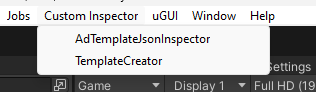
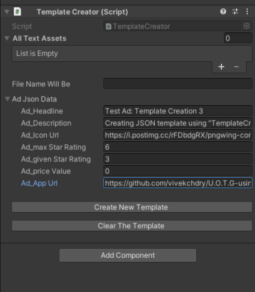

# U.O.T.G using JSON File
 Unity Object Template Generator With JSON
 
### How to Create JSON Template

	1. Go to the Menu Item and select "Template Creator tool" in your hierarchy.
	2. Fill in the appropriate data without disregarding any errors displayed.
	3. Click "Create New Template" to generate a new JSON file.
	4. The path of the new file will be "Resources/JSONTemplates/JsonAssets_AdTemplate.txt."

### How to Inspect JSON Template or Create UI Templates
	1. Go to the Menu Item and select "Template Inspector tool" in your hierarchy.
	2. Drag and drop the required 'JsonAssets_AdTemplate.txt" file into the Text Asset field.
	3. Click "Load JSON Data" to load data from the selected JSON file.
	4. If you wish to edit the JSON file, change the data in the fields without disregarding any errors displayed.
	5. If you want to generate a UI template in the hierarchy using the selected JSON file, click "Create UI Template In Scene."

 

**Menu Item Utility.**

**Template Creator Tool use case.**

**Template Inspector Load Data Tool use case.**

**Template Inspector Save Edited Data Tool use case.**

**Create UI Templates using JSON Template Tool use case.**
